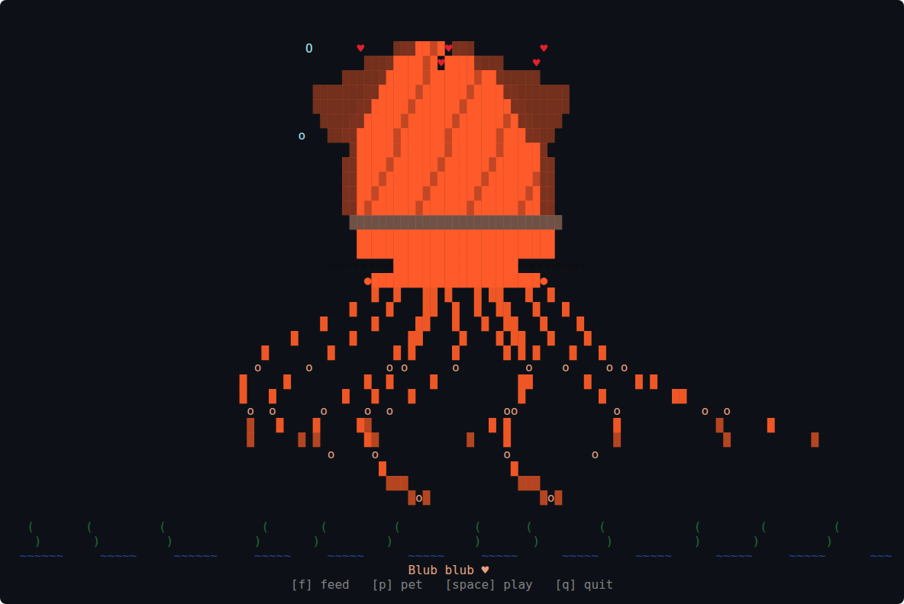

# squid-pet 🦑

<p align="center">
  
</p>

A full-screen, colored ASCII giant squid pet for your terminal. It fills the window, sways, blinks, and blows bubbles, and you can feed it, pet it, and play with it. It's written in Rust with [ratatui](https://ratatui.rs) and the colors are based on photos of real giant squid. Nothing is saved between runs.

## Quickstart 🚀

Requires Rust (install it with [rustup](https://rustup.rs)).

```
git clone https://github.com/Gidntsquia/squid-pet
cd squid-pet
cargo install --path .   # Builds the release binary and puts squid-pet on your PATH
squid-pet
```

Press `f` to feed, `p` to pet, `space` to play, and `q`, `Esc` or Ctrl-C to quit.

On Linux x86_64 you can skip Rust and download a prebuilt binary from the [releases page](https://github.com/Gidntsquia/squid-pet/releases).

Other commands:

```
squid-pet --ascii      # Draws without Unicode glyphs
squid-pet --seed 42    # Same random behavior every run
NO_COLOR=1 squid-pet   # Monochrome
```

## Features 🔬

- The squid is drawn procedurally to fit the window and is redrawn when you resize it.
- Tentacles sway, the body bobs, the eyes blink, and bubbles drift up past seaweed and waves.
- The squid rests, then swims sideways in short bursts to a new spot.
- Feeding drops a small fish from the top of the screen; the tentacles grab it and the squid puffs up.
- Petting closes its eyes, makes it blush, and sends hearts floating up.
- Playing makes it squirt an ink cloud and dart around the screen.
- Every so often it yawns, looks around, or lets out a small ink puff on its own.
- Uses truecolor when the terminal supports it and falls back to 256 colors.

## Documentation 📚

- [Development](docs/Development.md) — code layout, building, releases, tests

## License 📄

[MIT](LICENSE).
